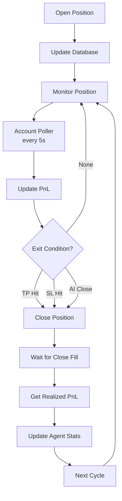

# MIRA - AI-Powered Prediction Market Terminal

Real-time AI-powered prediction market interface with live trading analytics and neural network visualizations.

## Features

### AI Agent System
- Multiple AI models for diverse trading strategies
- Real-time decision making and market analysis
- Performance tracking and analytics

### Prediction Market Integration
- Polymarket API integration
- Real-time market data
- Category filtering and search

### Trading Interface
- Interactive bubble visualization
- Zoom and pan controls
- Real-time position tracking
- Trade execution on Solana

### Agent Builder
- 3-step wizard interface
- Strategy configuration
- Risk management settings
- Live testing and deployment

## Trade Lifecycle Flowchart

The following flowchart illustrates how AI agents manage trading positions from opening to closing:



### Flow Explanation

1. **Open Position**: Agent opens a new trading position based on AI analysis
2. **Update Database**: Position details are stored in the database
3. **Monitor Position**: Continuous monitoring of the open position begins
4. **Account Poller**: Every 5 seconds, the system polls the account for updates
5. **Update PnL**: Profit and Loss is calculated and updated based on current market prices
6. **Exit Condition Check**: System checks if any exit condition is met:
   - **TP Hit**: Take Profit target reached
   - **SL Hit**: Stop Loss limit reached
   - **AI Close**: AI agent decides to close based on market analysis
   - **None**: No exit condition met, continue monitoring
7. **Close Position**: When an exit condition is met, the position is closed
8. **Wait for Close Fill**: System waits for the close order to be filled
9. **Get Realized PnL**: Final profit/loss is calculated
10. **Update Agent Stats**: Agent performance statistics are updated
11. **Next Cycle**: Process returns to monitoring for the next trading opportunity

## Tech Stack

- **Frontend:** React + TypeScript + Vite
- **Backend:** Express.js + Node.js
- **UI:** shadcn/ui + Tailwind CSS
- **Blockchain:** Solana Web3.js
- **Deployment:** Railway

## Development

### Prerequisites
- Node.js 18+
- npm

### Installation

```bash
npm install
```

### Run Development Server

Start both frontend and backend:
```bash
npm run dev:all
```

Or separately:
```bash
# Terminal 1: Backend
npm run server

# Terminal 2: Frontend
npm run dev
```

The application will be available at:
- Frontend: `http://localhost:3000`
- Backend: `http://localhost:3002`

### Build

Build for production:
```bash
npm run build
```

## Environment Variables

### Backend (Railway/Server)

Required:
- `PORT` - Server port (auto-set by Railway)
- `NODE_ENV` - Environment (production/development)

Optional:
- `REDIS_URL` - Redis connection URL for session storage (highly recommended for production)
  - **How to get:** Add Redis addon in Railway dashboard → Your Service → "+ New" → "Database" → "Add Redis"
  - Railway will automatically set this variable when you add the Redis addon
  - Without Redis, sessions are stored in memory (lost on restart, won't work across multiple instances)
- `ALLOWED_ORIGINS` - Comma-separated list of allowed CORS origins
- `CSRF_SECRET` - Secret for CSRF token generation (recommended for production)
- `SESSION_SECRET` - Secret for session management (required for Google OAuth, recommended for production)
- `GOOGLE_CLIENT_ID` - Google OAuth Client ID (required for Google login)
- `GOOGLE_CLIENT_SECRET` - Google OAuth Client Secret (required for Google login)
- `GOOGLE_CALLBACK_URL` - Google OAuth callback URL (defaults to `https://mira.tech/api/auth/google/callback` in production)
- `NEWS_API_KEY` - NewsAPI.org API key
- `NEWSDATA_API_KEY` - NewsData.io API key
- `GNEWS_API_KEY` - GNews API key
- `POLYMARKET_API_KEY` - Polymarket API key
- `POLYMARKET_SECRET` - Polymarket API secret
- `POLYMARKET_PASSPHRASE` - Polymarket API passphrase
- `SMTP_HOST` - SMTP server host
- `SMTP_PORT` - SMTP server port
- `SMTP_USER` - SMTP username
- `SMTP_PASS` - SMTP password
- `NOTIFICATION_EMAIL` - Email for waitlist notifications

### Frontend

Optional:
- `VITE_API_BASE_URL` - Custom API base URL (defaults to relative URLs in production)

## Project Structure

```
aura-predict/
├── src/
│   ├── components/     # React components
│   │   ├── ui/         # shadcn/ui components
│   │   └── ...         # Feature components
│   ├── pages/          # Page components
│   ├── hooks/          # Custom React hooks
│   ├── lib/            # Utility libraries and API clients
│   └── types/          # TypeScript type definitions
├── server/
│   ├── services/       # Business logic services
│   ├── utils/          # Utility functions
│   └── index.js        # Express server
├── public/             # Static assets
└── dist/               # Production build output
```

## Google OAuth Setup

To enable Google login:

1. **Create Google OAuth Credentials:**
   - Go to [Google Cloud Console](https://console.cloud.google.com/)
   - Create a new project or select an existing one
   - Enable the Google+ API
   - Go to "Credentials" → "Create Credentials" → "OAuth client ID"
   - Choose "Web application"
   - Add authorized redirect URIs:
     - Production: `https://mira.tech/api/auth/google/callback`
     - Development: `http://localhost:3002/api/auth/google/callback`

2. **Set Environment Variables:**
   ```bash
   GOOGLE_CLIENT_ID=your-client-id.apps.googleusercontent.com
   GOOGLE_CLIENT_SECRET=your-client-secret
   SESSION_SECRET=your-session-secret  # Generate with: openssl rand -base64 32
   ```

3. **Deploy:**
   - Add these variables to your Railway project settings
   - The OAuth flow will work automatically once configured

## Security

The application includes comprehensive security features:
- CSRF protection
- Rate limiting
- Input validation
- Security headers (Helmet.js)
- CORS configuration
- Error sanitization
- Google OAuth authentication
- Secure session management

## License

This project is private and proprietary.

## Contact

For inquiries about MIRA, please contact dev@mira.tech

---

**Built for the prediction market community**

